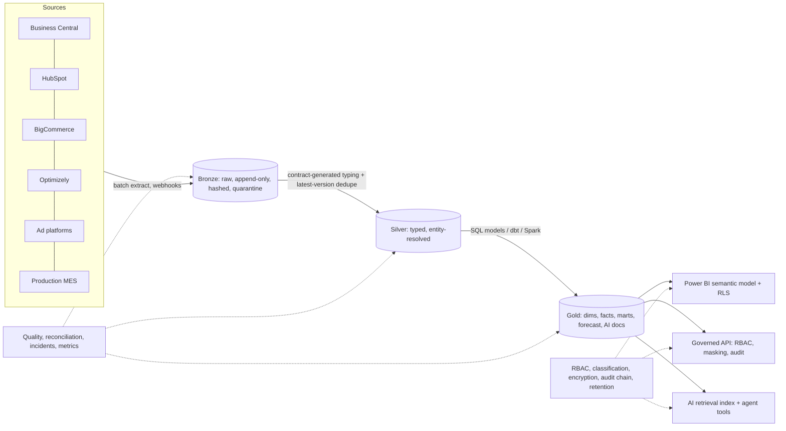

# Architecture

World Emblem's critical data lives in Business Central (ERP), HubSpot, Optimizely, BigCommerce, marketing platforms and production systems. Using many systems is normal.
What is missing is **ownership of the data that moves between them**. This repository is that ownership, as code.

## Principles

1. **Operational systems stay operational.** Business Central runs the business; it is never the analytics or AI platform. Each platform team keeps ownership of its system.
2. **One authority per domain** (with field-level exceptions) recorded in `system_of_record.yaml` and enforced by a validator in CI.
3. **Contracts first.** `contracts.yaml` defines every source dataset: types, required fields, aliases, classification, freshness SLA, retention. Silver staging SQL is generated from it.
4. **Idempotent by construction.** At-least-once delivery + content-hash dedupe = exactly-once effect. Replays are no-ops.
5. **Governed access only.** Reports, AI agents and internal apps read gold through the semantic model, the API or allow-listed tools. No direct production access.
6. **Fix at the source.** A failed check opens an incident for the business owner with a concrete source-side action; Data Platform does not patch reports.
7. **Portable.** SQL + Spark + Parquet/Delta, orchestrated by Airflow. The platform choice (Fabric recommended) is reversible.

## Layers

## Batch, events and APIs

| Pattern | Used for | Where |
|---|---|---|
| Batch (scheduled) | ERP, CRM, marketing, MES extracts | `dags/emblem_daily_elt.py`, `pipelines/bronze.py` |
| Events | BigCommerce / HubSpot webhooks: HMAC-signed, replay-protected, idempotent inbox, dead-letter | `ops/events.py`, `POST /v1/webhooks/{source}` |
| APIs | Governed reads, AI tools, quality and lineage | `api/app.py` |

## Schema change policy

Additive change: logged, kept in the payload, contract updated by PR. Known rename: mapped through contract `aliases`. Breaking change (required field vanished or type changed): rows are **quarantined**, a critical `schema` check fails, SEV1 incident opens. `contracts.diff_contracts` classifies proposed changes in CI review.

## Data model (gold)

Common entities and identifiers: `company_key` (resolved), `contact_key` (email hash), `product_key` (BC item no.), `order_no`, `revenue_key`, `inventory_key`, `location_key`, `work_order_key`. Facts: `fact_order_line`, `fact_revenue`, `fact_inventory_snapshot`, `fact_production`, `fact_marketing_spend`. Marts: `mart_revenue_monthly`, `mart_company_360`, `mart_marketing_roi`, `forecast_revenue`. Exception queue: `exc_web_orders_missing_in_erp`.

## Retention

Per-dataset in the contract; enforced by `security/retention.py` (dry-run default, `apply` is explicit). Audit log 7 years; webhook inbox 30 days; AI usage log 1 year.
