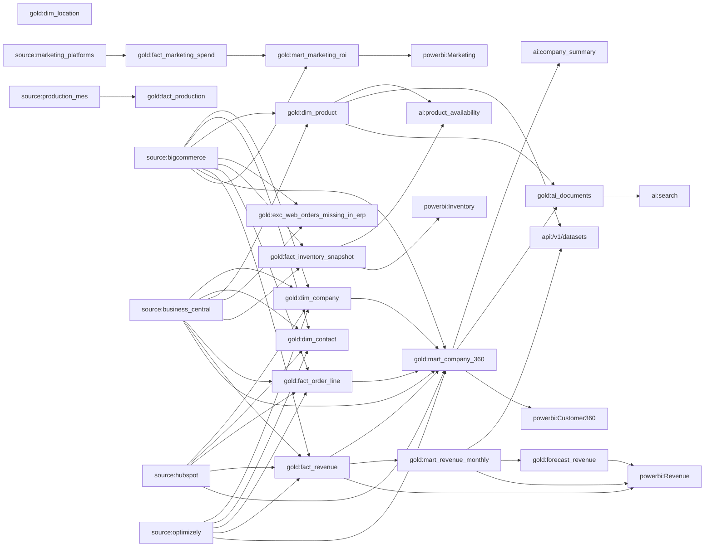

# Lineage (generated)

Generated by `uv run emblem docs` from contracts and SQL `ref()` calls.

```mermaid
flowchart LR
  n0["ai:company_summary"]
  n1["ai:product_availability"]
  n2["ai:search"]
  n3["api:/v1/datasets"]
  n4["gold:ai_documents"]
  n5["gold:dim_company"]
  n6["gold:dim_contact"]
  n7["gold:dim_location"]
  n8["gold:dim_product"]
  n9["gold:exc_web_orders_missing_in_erp"]
  n10["gold:fact_inventory_snapshot"]
  n11["gold:fact_marketing_spend"]
  n12["gold:fact_order_line"]
  n13["gold:fact_production"]
  n14["gold:fact_revenue"]
  n15["gold:forecast_revenue"]
  n16["gold:mart_company_360"]
  n17["gold:mart_marketing_roi"]
  n18["gold:mart_revenue_monthly"]
  n19["powerbi:Customer360"]
  n20["powerbi:Inventory"]
  n21["powerbi:Marketing"]
  n22["powerbi:Revenue"]
  n23["source:bigcommerce"]
  n24["source:business_central"]
  n25["source:hubspot"]
  n26["source:marketing_platforms"]
  n27["source:optimizely"]
  n28["source:production_mes"]
  n4 --> n2
  n5 --> n16
  n8 --> n1
  n8 --> n3
  n8 --> n4
  n10 --> n1
  n10 --> n20
  n11 --> n17
  n12 --> n16
  n14 --> n16
  n14 --> n18
  n14 --> n22
  n15 --> n22
  n16 --> n0
  n16 --> n4
  n16 --> n19
  n17 --> n21
  n18 --> n3
  n18 --> n15
  n18 --> n22
  n23 --> n5
  n23 --> n6
  n23 --> n8
  n23 --> n9
  n23 --> n10
  n23 --> n12
  n23 --> n14
  n23 --> n16
  n23 --> n17
  n24 --> n5
  n24 --> n6
  n24 --> n8
  n24 --> n9
  n24 --> n10
  n24 --> n12
  n24 --> n14
  n24 --> n16
  n25 --> n5
  n25 --> n6
  n25 --> n12
  n25 --> n14
  n25 --> n16
  n26 --> n11
  n27 --> n5
  n27 --> n6
  n27 --> n12
  n27 --> n14
  n27 --> n16
  n28 --> n13
```
